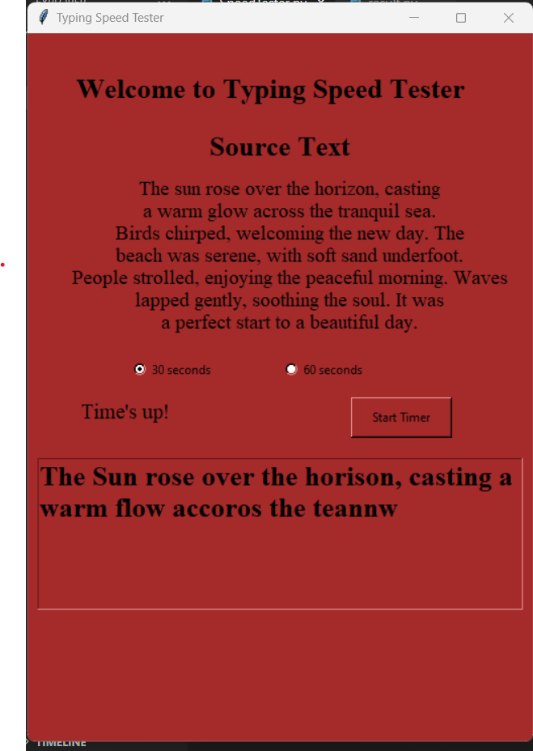

# Typing Speed Test



A simple Python application for testing your typing speed. This application presents you with a random paragraph, and you need to type it as quickly and accurately as possible within a specified time limit. After the time is up, the application calculates and displays your typing accuracy and words per minute (WPM).

## Table of Contents
- [Features](#features)
- [Requirements](#requirements)
- [Installation](#installation)
- [Usage](#usage)
- [Contributing](#contributing)


## Demo


[View Demo](https://www.example.com)

## Features

- Randomly generated paragraphs for typing practice.
- Adjustable timer (30 seconds or 60 seconds).
- Real-time countdown timer.
- Calculation of typing accuracy and words per minute (WPM).
- User-friendly GUI using Tkinter.

## Requirements

- Python 3.x
- Tkinter (usually included with Python)

## Installation

1. Clone the repository to your local machine using:

   ```bash
   git clone https://github.com/yourusername/Typing-speed-Test.git
   ```

2. Change directory to the project folder:

   ```bash
   cd Typing-speed-Test
   ```

3. Run the application:

   ```bash
   python main.py
   ```

## Usage

1. Launch the application using the installation instructions above.

2. Choose your preferred time limit (30 seconds or 60 seconds) by selecting the corresponding radio button.

3. Click the "Start Timer" button to begin the typing test.

4. You will be presented with a random paragraph in the text area. Type the paragraph as quickly and accurately as possible.

5. The countdown timer will display the time left.

6. After the time is up, the application will display your typing accuracy and words per minute (WPM).

7. You can restart the test by clicking the "Start Timer" button again.

## Contributing

Contributions are welcome! If you have any suggestions, feature requests, or find any issues, please feel free to open an issue or create a pull request.
